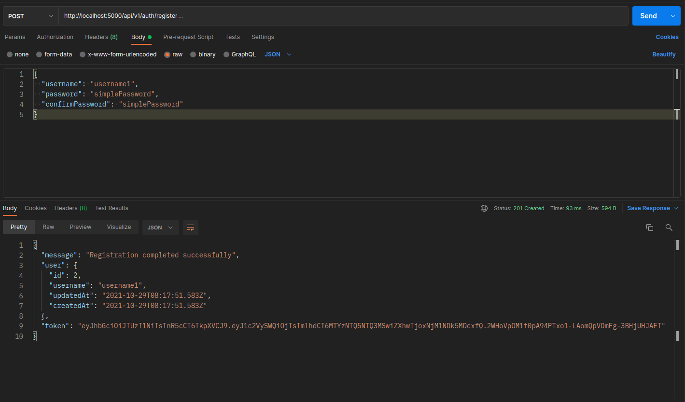

# Profiles

An API that allows users to upload a csv file of users' profiles. The CSV file contains column including, Names, NID, Phone Number, Gender, and Email. It was a challenge to prove that I can code.

## Technologies

`Nodejs, Express, PostgreSQL, ect...`

## Process to run this app

> To get started running the app:

1. After install the above required tools
2. Clone the app with this command: `git clone https://github.com/blaisebakundukize/profiles.git`
3. Create a database in PostgresSQL
4. Create a `.env` file on the root of the project, then include environments found in `.env.sample`
5. Run `yarn install` or `npm install` to install dependencies
6. Run `yarn run migration` to create tables in Database
7. Run `yarn/npm run watch:dev` it will start the project on a default port (5000)

## Endpoints

### Register:

- `POST /api/v1/auth/register`

```
{
  "username": "superUser30",
  "password": "simplePassword",
  "confirmPassword": "simplePassword"
}
```

### Login:

- `POST /api/v1/auth/login`

```
{
  "username": "superUser30",
  "password": "simplePassword"
}
```

> > Endpoints require Bearer token

### Create Profiles - Upload CSV file

- `POST /api/v1/users/profiles/upload`

> Form-data

| KEY  | VALUE        |
| ---- | ------------ |
| file | fileName.csv |

### Get Profiles

- `GET /api/v1/users/profiles?limit=1&page=1`

## Image examples

### Register



### Login


### Create Profiles - Upload CSV file


### Get Profiles


